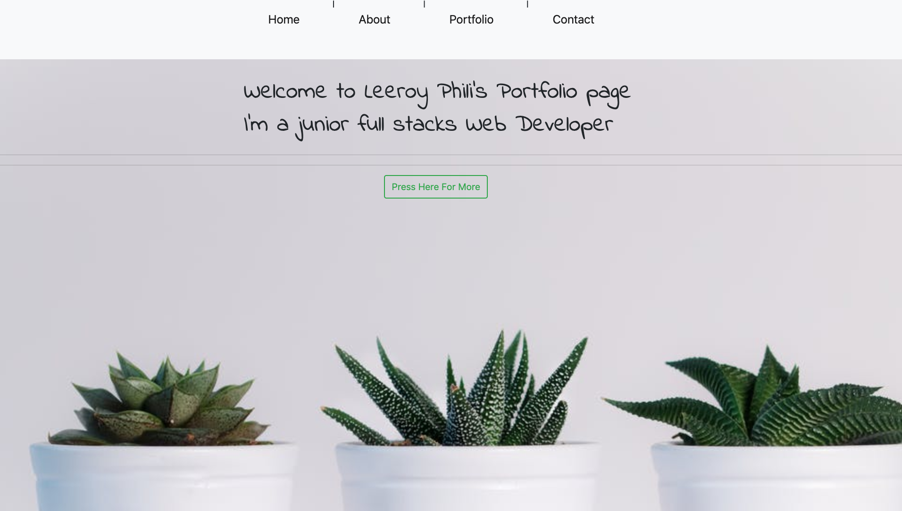
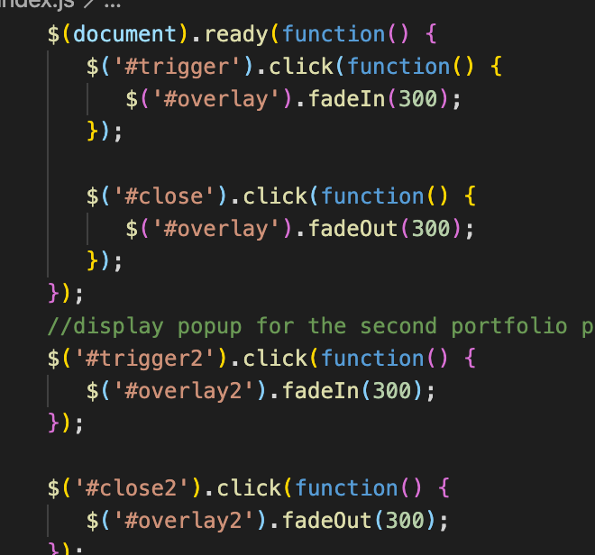

Web link: https://leeroyp.github.io/A8-Responsive-portfolio.io/

Assignemtn 8 - Responsive Portfolio 

This was my very first detailed portfolio.  In this assingment i tried to showcase as many skills as i have acquired to display in my portfolio. 

First step was to design a simple UI that couldn't be too complicated, I mostly used HTML , with some help of javascript I was able to get some very smooth scrolling addded to the html 

I applied the used of Bootstrap and CSS to add some styling and color that would bring the page to life 

In the home page I used buttons from Bootstrap to link with the scrolling pages so the user can simplie go to the desired page with a simple click

We followe the home page with an about me page. This page provides a briefing about my journey so far as a web developer. Some of the stuff that can be found on this page includes a small bio about me , resume , and some of the skills that have been acquired in the program 

Then comes the portfolio page, here we diplayed some of my favourite assignments that I have worked on so far.  We used bootstrap carousel to display a slideshow of some of the projects. Using buttons provided  page visitors can simple click each project to see more details about each project from an overlay popup 

Finally visitors can simple connect to me via linkndin , github , email or through phone with each info provided on the page with links to github and linkndin

Code Snipet

